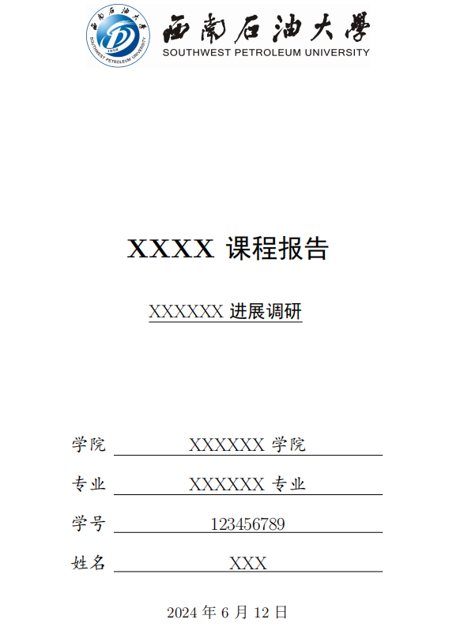
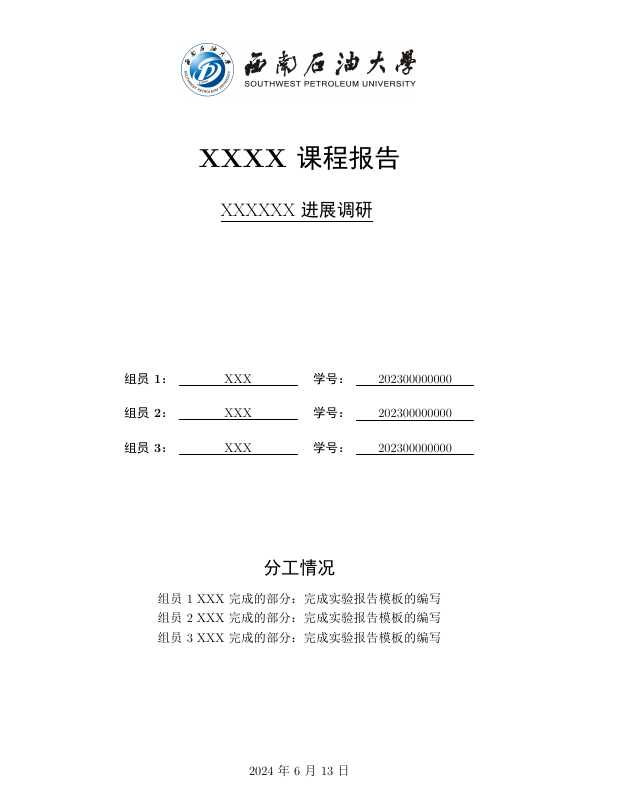

<h1 align="center">
  
   
  西南石油大学通用课程大作业模板
</h1>

  Latex Template for SWPU Report

## 介绍
- 用于西南石油(SWPU)课程大作业/结课汇报的通用简易Latex模板，基于[国科大模板](https://github.com/jweihe/UCAS_Latex_Template)修改学校logo等信息

- 单人封面

- 多人封面

## 模板下载

* 页面右边点击：**Clone or download -> Download Zip**

## 使用方法
默认模板文件由以下四部分组成：

- `main.tex` 主文件,包含报告正文
- `reference.bib` 参考文献列表
- `SWPUReport.sty` 文档格式控制，包括一些基础的设置，可以设置页眉、标题、姓名等
- `figures` 放置图片的文件夹,包含院校LOGO和效果预览图

使用时需前往`SWPUReport.sty` 对标题、副标题、姓名、学号、院所、页眉等进行设置，然后编辑`main.tex`进行正文编写

## 参考

+ [GBT7714-2015标准下的BibTex样式](https://github.com/zepinglee/gbt7714-bibtex-style)
+ [国科大学位论文LaTeX模板](https://github.com/mohuangrui/ucasthesis)
+ [北京大学课程论文模板](https://www.overleaf.com/latex/templates/bei-jing-da-xue-ke-cheng-lun-wen-mo-ban/yntmqcktrzfh)
+ [国科大通用课程大作业模板](https://github.com/jweihe/UCAS_Latex_Template)

